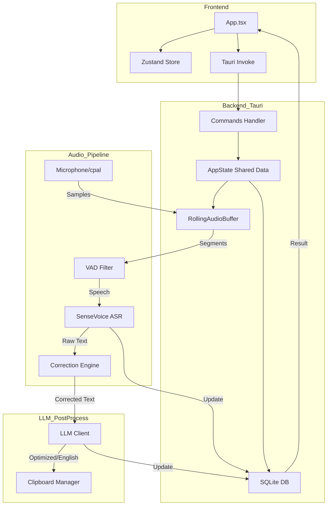

# Streaming Speech 项目概要设计

## 1. 项目概述
Streaming Speech 是一个基于 Rust 和 React 开发的高性能桌面实时语音识别与翻译工具。它利用 Tauri 框架构建跨平台应用，集成了本地 ASR（语音转文本）模型和远程 LLM（大语言模型）服务，为用户提供实时字幕、文本纠错、自动翻译及剪贴板同步功能。

## 2. 技术栈
- **前端**: React, Vite, TailwindCSS, Zustand (状态管理), Tauri API (IPC)。
- **后端 (Rust)**:
  - **运行时**: `tokio` (全功能异步运行时)。
  - **音频处理**: `cpal` (音频采集), `sherpa-onnx` (VAD 及 SenseVoice ASR 模型)。
  - **网络/LLM**: `reqwest` (异步 HTTP), `async-openai` (OpenAI 兼容协议)。
  - **数据库**: `rusqlite` (本地 SQLite 存储)。
  - **剪贴板**: `tauri-plugin-clipboard-manager`。

## 3. 系统架构

### 3.1 逻辑架构
系统分为三层：
1.  **UI 层 (Frontend)**: 负责用户交互、设置管理、识别结果的实时展示。
2.  **核心服务层 (Backend Service)**:
    - **音频采集模块**: 监听麦克风，处理采样率转换及声道合并。
    - **ASR 识别引擎**: 负责语音 activity 检测 (VAD) 及语音转文本。
    - **纠错与优化引擎**: 结合本地规则映射及 LLM 进行文本润色。
    - **异步数据库写入器**: 通过事件队列实现非阻塞的数据持久化。
3.  **持久化层 (Storage)**: 存储历史会话、纠错规则及应用设置。

### 3.2 核心模块关系 (Mermaid)

## 4. 关键流程设计

### 4.1 实时录音与识别流
1.  用户点击“开始录音”，后端开启 `cpal` 输入流。
2.  音频采样点被推入 `RollingAudioBuffer`。
3.  识别主循环轮询 VAD，检测到语音段后截取音频。
4.  调用 `sherpa-onnx` 进行离线模型推理。
5.  **纠错**: 经过 `CorrectionEngine` 进行本地词表映射。
6.  **版本控制**: 每个 Segment 拥有唯一的 `segment_id` 和递增的 `revision`。
7.  **异步分发**:
    - 发送 `DbEvent::InsertSegment` 给数据库工作线程。
    - 触发 `spawn_llm_postprocess_task` 进行 LLM 异步处理。
    - 前端轮询 `get_recording_state` 获取最新的 Segments 列表并按 `revision` 合并。

### 4.2 LLM 异步后处理
1.  ASR 识别完成后，生成一个异步任务。
2.  任务检查 `LlmSettings`，调用远程模型（如 GPT-4o-mini 或本地 Ollama）。
3.  **串行处理**: 先优化中文文本 -> 保存结果 -> 再翻译为英文 -> 保存结果。
4.  **自动复制**: 根据 `auto_copy_mode` 配置，将最终结果写入系统剪贴板。

## 5. 数据库设计
主要表结构：
- `sessions`: 存储录音会话元数据（开始/结束时间、采样率）。
- `asr_raw_records`: 存储 ASR 识别的原始文本及其状态（`pending`, `success`, `failed`）。
- `asr_llm_results`: 存储 LLM 优化后的文本及翻译结果。
- `correction_rules`: 存储纠错规则（Source -> Target）。

## 6. 安全与性能优化
- **非阻塞 IO**: 音频采集与 ASR 模型推理在独立线程运行，不占用 tokio 异步池。
- **内存管理**: `RollingAudioBuffer` 采用循环缓冲区，限制最大内存占用（默认 120 秒）。
- **可见性控制**: 核心逻辑封装在 `src-tauri/src/lib.rs` 中，内部模块保持私有，通过 `AppState` 共享状态。
- **鲁棒性**: 数据库写入使用独立 Channel，确保在高并发识别时不会导致主逻辑阻塞。
